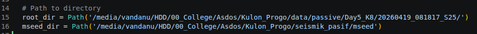

# SEG2 to MiniSEED Conversion

The SUMMIT M VIPA seismograph records seismic data in SEG-2 format, with each record segmented into 60s intervals. One limitation of the SEG-2 format is the complexity and redundancy of its header information, which can make data handling and processing less efficient. Therefore, it is often necessary to convert the data into a simpler and more standardized format, such as MiniSEED. MiniSEED is widely used for seismic data exchange and provides a more compact structure with minimal header information, making it better suited for processing workflows. The [seg2_to_mseed](./seg2_to_mseed.py) script can be used to convert SEG-2 field data into MiniSEED format prior to further processing in Geopsy.

## Script Overview
The script reads all SEG-2 files in a directory, extracts the three components (X, Y, and Z), and merges them into continuous traces. Instead of converting each file individually, the script first combines all segments in memory to ensure a continuous time series. After merging, the traces are assigned standard channel names (EHE, EHN, EHZ) and then written into a single MiniSEED file for each station. This approach reduces file fragmentation and produces a cleaner dataset for analysis.

## How to Run the Script
### 1. Create a virtual environment (better than using global env)

**Windows (CMD/PowerShell)**

```bash
python -m venv hvsr_venv
hvsr_venv\Scripts\activate
```

**Linux/macOS (Terminal)**

```bash
python3 -m venv hvsr_venv
source hvsr_venv/bin/activate
```

### 2. Install Dependencies
After activating the virtual environtment, install the dependencies (mainly requires ObsPy, this also include numpy and the other necessary libraries)

**Windows**

```bash
pip install obspy
```

**Linux/MacOS**

```bash
pip3 install obspy
```

### 3. Run the Script

> A. Using CMD/Terminal

Firstly you need to navigate to the script directory, and change the data and converted files directory.



**Windows**

```bash
python seg2_to_mseed.py
```

**Linux/MacOS**

```bash
python3 seg2_to_mseed.py
```

> B. Using Spyder

- Open Spyder 
- Open the `seg2_to_mseed.py` file
- Make sure your Python interpreter is set to the virtual environment (optional but recommended)
- Run the script

