# Horizontal-to-Vertical Spectral Ratio
The Horizontal-to-Vertical Spectral Ratio (HVSR) method uses the Fourier spectra of horizontal and vertical components of seismic noise. It's widely applied to estimate the thickness of unconsolidated sediments above bedrock in sedimentary basins and to identify the site's fundamental frequency ($f_0$). This method requires only a single seismometer and a relatively short recording time, typically ranging from minutes to hours. HVSR, including derivative analyses such as the Rayleigh wave ellipticity curve, can be inverted to estimate the vertical S-wave velocity profile.

We will use Geopsy software for HVSR processing. The software can be downloaded [here](https://www.geopsy.org/download.php). Make sure to select the version that matches your operating system. Installation tutorials are also provided on the website.

## 1. Import Signals
After converting the raw recorded signals into MiniSEED format, we import the data into Geopsy. When you open Geopsy, a pop up window will appear. In this window, you can set the allocated memory for running the Geopsy software. In this example, about 12 GiB of memory is allocated. After setting the memory, click OK to close the pop up window.

<div align="center">
  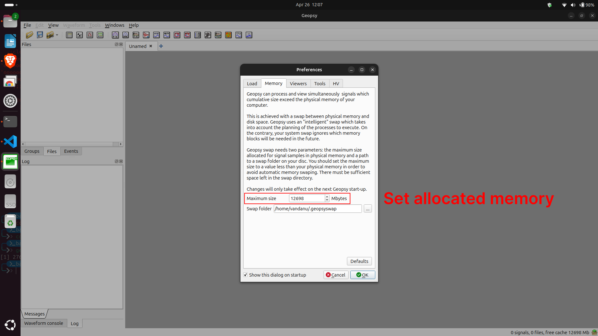
  <p><b>Fig 1.</b> Memory allocation</p>
</div>

There are two ways to import signals into Geopsy: <br>
(a) open `File > Import Signals > File`, or <br>
(b) drag and drop the data directly from the file explorer.

<div align="center">
  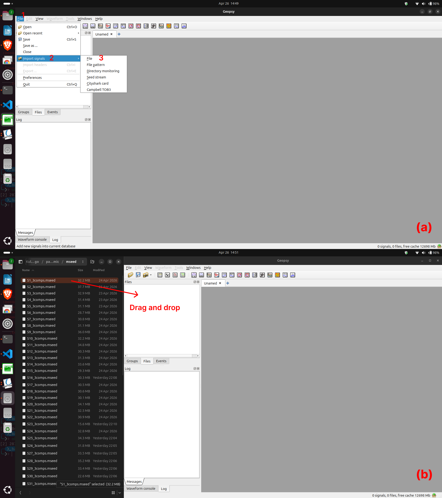
  <p><b>Fig 2.</b> Input MiniSEED files</p>
</div>

The imported files will appear in the `Files` tab in Geopsy. 

## 2. H/V Spectral Ratio
### 2.1. Opening the H/V tool box
Use H/V toolbox to computing HVSR. You can click and drag the signal into the `H/V Toolbox`.

<div align="center">
  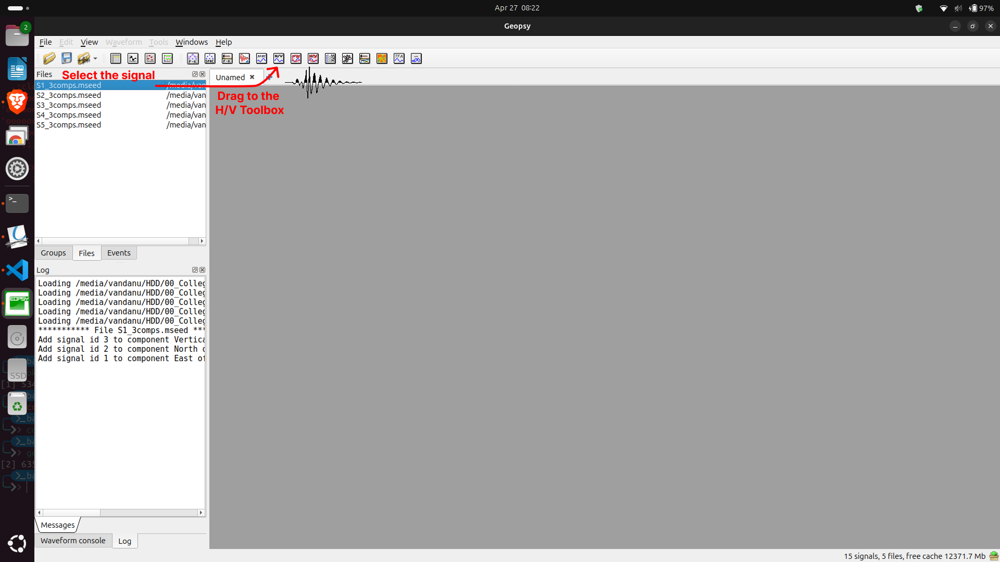
  <p><b>Fig 3.</b> Drag MiniSEED files to the H/V toolbox</p>
</div>

The H/V tool box is divided into three parts: the processing, windowing tabs, and H/V plot result. 

<div align="center">
  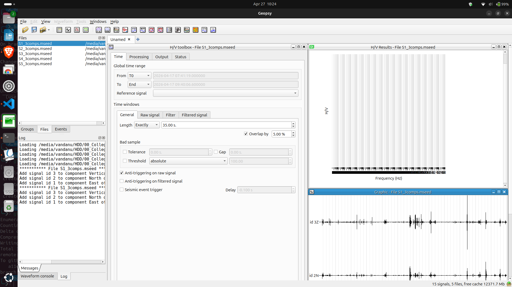
  <p><b>Fig 4.</b> The interface of H/V toolbox</p>
</div>

In the "Processing" tab, you can set the parameters for process the H/V computation (window length, the smoothing function, the frequency range, etc ...). In the "Windowing" tab you have several tools to define the windows selection.

### 2.2. Windowing

The three seismic components, north-south (NS), east-west (EW), and vertical (V), are divided into several time windows. Each window length should be at least 10 times longer than the estimated fundamental period (10/$`f_0`$), following SESAME ([2004](https://sesame.geopsy.org/Delivrables/Del-D23-HV_User_Guidelines.pdf)). For example, if the estimated fundamental frequency is 3 Hz, the recommended window length should be long enough (around 30 s) to increase the reliability of the curve especially in low frequency. Windowing is used to select stationary signals and avoid transient noise such as footsteps or nearby traffic.

**Recommended parameters:**
- Window length: 30 s (or 30 to 50 s)
- Overlap: 5%

<div align="center">
  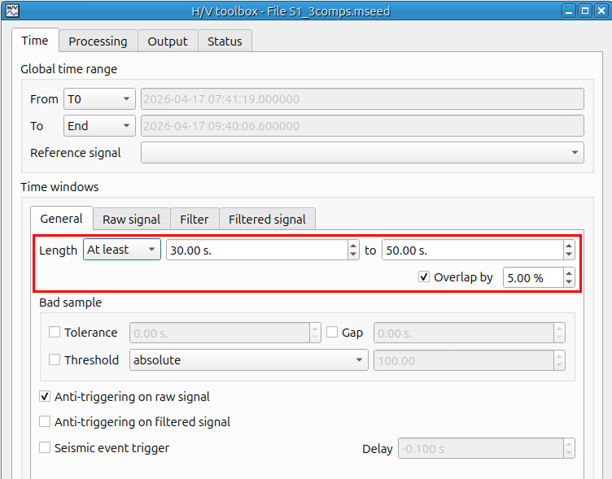
  <p><b>Fig 5.</b> Windowing menu</p>
</div>

#### Automatic Window Selection (STA/LTA)

To perform automatic windowing in Geopsy:

1. Open the `General` in H/V toolbox.  
2. Select `anti-triggering on raw signal` as the window selection method.  
3. In `Raw Signal`, set the following parameters:  
   - `Min STA/LTA`: small positive value (default is usually acceptable)
   - `Max STA/LTA`: 1.5 - 2  
4. Run the automatic selection to generate time windows by click `Select` and `Start` to compute HVSR (Fig. 7).

The STA/LTA method selects windows with stable amplitudes and avoids energetic transients.

<div align="center">
  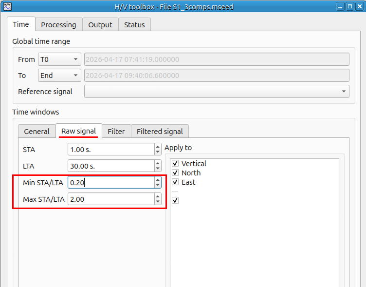
  <p><b>Fig 6.</b> STA/LTA parameters</p>
</div>

<div align="center">
  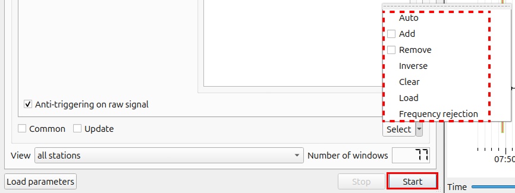
  <p><b>Fig 7.</b> Change the windowing mode</p>
</div>

#### Window QC

After automatic window selection, manually check the windows to remove unwanted transient noise.

1. Click `Start` to compute the HVSR curves.  
2. Check the HVSR curves and match the curve colors with the window colors.  
3. Identify noisy curves (for example, unstable or outlier curves).  
4. Change the windowing mode from `Auto` to `Remove`.  
5. Select and remove the windows that correspond to the noisy curves.

<div align="center">
  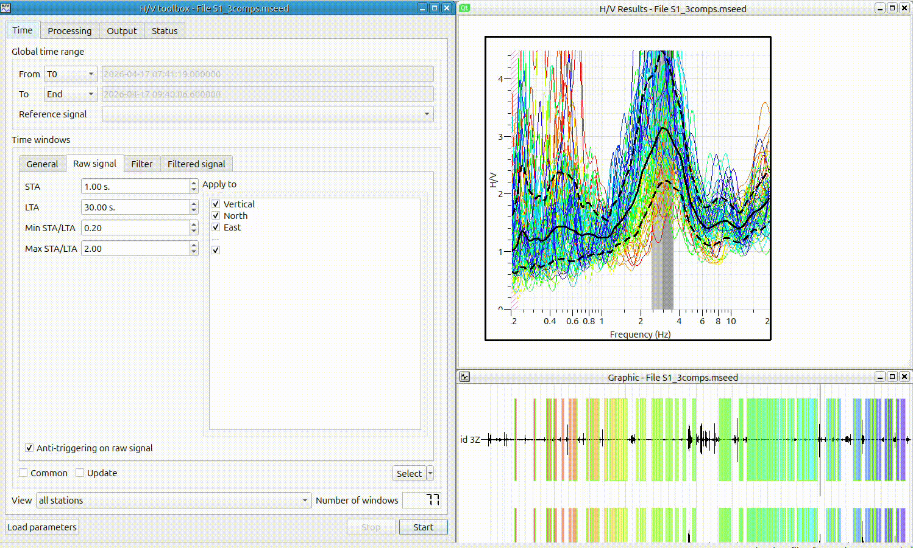
  <p><b>Fig 8.</b> Remove noisy curves caused by transient noise</p>
</div>

### 2.3. Processing parameters
After selecting the appropriate time windows, the HVSR value is calculated from the horizontal and vertical spectral amplitudes within each window. In this study, the horizontal component is represented using the quadratic mean/squared average of the NS and EW components, which is expressed as:

$$
HVSR = \frac{\sqrt{(NS^2 + EW^2)/2}}{V}
$$

The other important processing parameters for computing H/V ratio is smoothing. These paramaters can be modified interactively by clicking on the `Processing` tab beside `Time` tabs (Fig. 6). 

### 2.4. H/V Computation and Output Format

As the HVSR curve becomes cleaner, the number of selected windows typically decreases (Fig. 9).

<div align="center">
  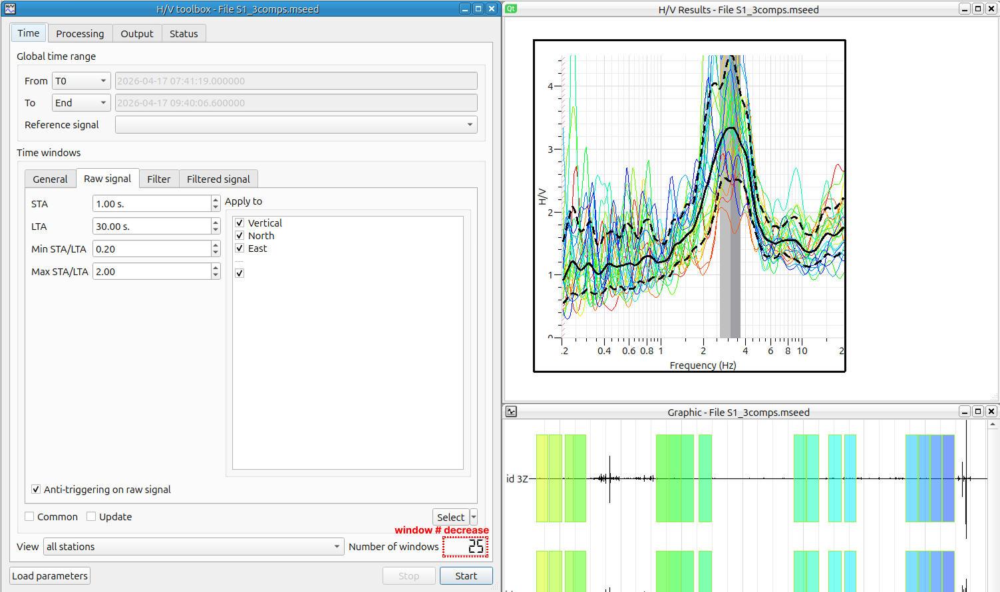
  <p><b>Fig 9.</b> Final HVSR curve</p>
</div>

After obtaining the final HVSR curve, save the results as text files (.hv and .log) and as an image (.png).

To export the results in Geopsy:

**a. Export as text**
1. Right click on the outside of plot.  
2. Click `Tools` > `Save results`.

**b. Export as image**
1. Right click on the outside of plot.
2. Click `File` > `Export image` or press `Ctrl+E`

<div align="center">
  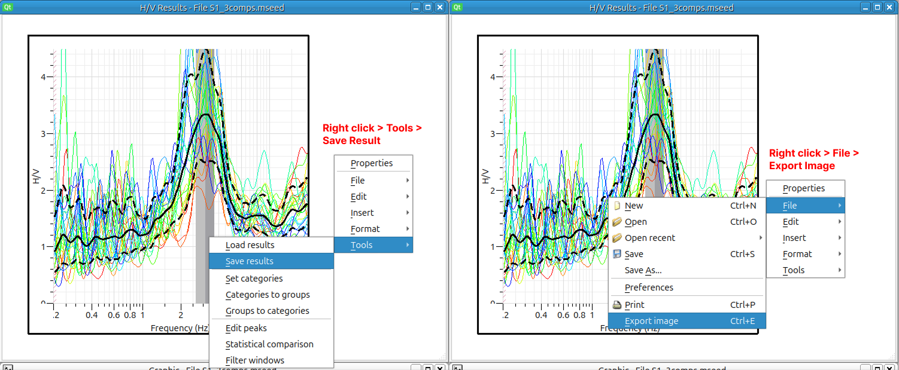
  <p><b>Fig 10.</b> Exporting the result</p>
</div>

### 2.5. Checking the Curve Reliability

The HVSR curve must meet the reliability and clear peak criteria according to the SESAME (2004) guidelines. Fig. 11 shows the reliability and clear peak criteria defined by SESAME.

<div align="center">
  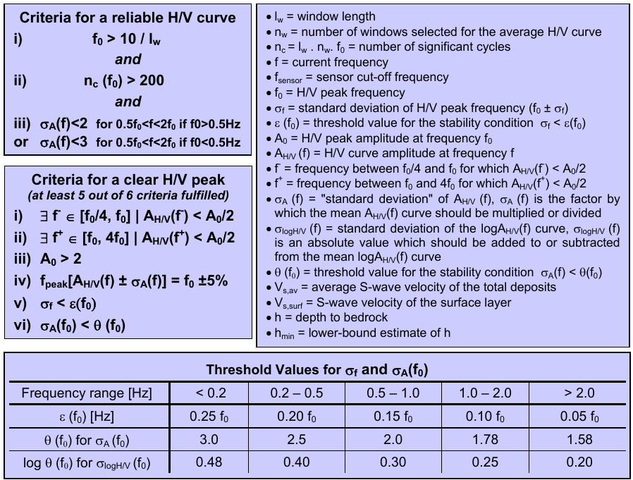
  <p><b>Fig 11.</b> Reliability and clear peak criteria (SESAME, 2004)</p>
</div>

For batch checking, Python can be used to evaluate these criteria using the [hvcheck](https://github.com/vandanue/hvsrcheck_modified.git) module.

#### Download the module

**a. Using `git` (recommended)**  

Make sure that you are using the same virtual environment that was previously used for merging MiniSEED files. Using `git` is recommended since this tool will be useful later.

```bash
git clone https://github.com/vandanue/hvsrcheck_modified.git
cd hvsrcheck_modified
```

**b. Download the `.zip` file**

Download the `.zip` file directly from this [link](https://github.com/vandanue/hvsrcheck_modified.git)

<div align="center">
  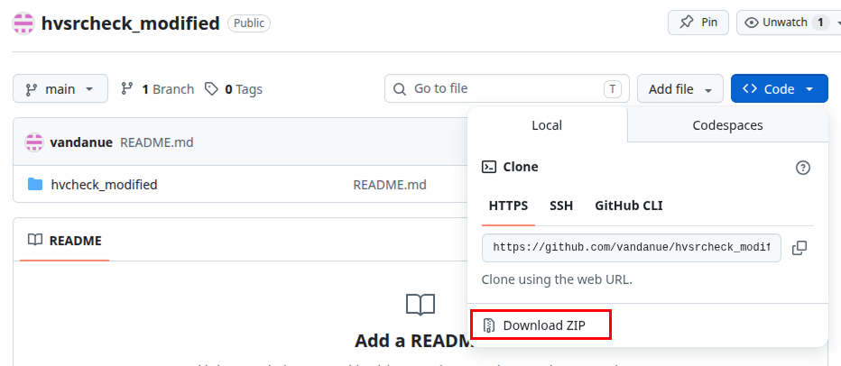
  <p><b>Fig 12.</b> Download compressed file of hvcheck from GitHub</p>
</div>

Install the module using `pip`

```bash
pip install .
```

change `pip` to `pip3` if you are using Linux.

#### Run the script
Run the `geopsy_hvsrcheck.py` script and change the directory path to the folder that contains all `.hv` and `.log` files.

<div align="center">
  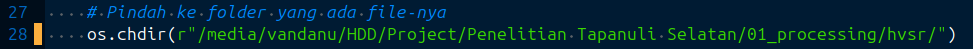
  <p><b>Fig 13.</b> Change the directory of .hv and .log files</p>
</div>

After changing the folder, you can run the script using Spyder or through the terminal

```bash
python geopsy_hvsrcheck.py
```

Change `python` to `python3` if you are using Linux

The output of `hvsrcheck` would be like this

```
-----------------------------------------------------------------------
File Name		: S42.hv
f0			: 3.9589 Hz
A0			: 3.76757
-----------------------------------------------------------------------
CRITERIA FOR A RELIABLE H/V CURVE
RELIABLE 1: OK
RELIABLE 2: OK
RELIABLE 3: OK

CLEAR PEAK SUMMARY: 5 out of 6
H/V IS CLEAR PEAK

-----------------------------------------------------------------------
RELIABILITY OUTPUT
RELIABLE 1: CRITERIA FULFILLED 			  3.96 > 0.2222222222222222
RELIABLE 2: CRITERIA FULFILLED 			  10332.73 > 200
RELIABLE 3: CRITERIA FULFILLED 			  0.56 < 2

CLEAR PEAK OUTPUT
CLEAR PEAK 1: CRITERIA FULFILLED 		  A_H/V(f⁻) < 1.88
CLEAR PEAK 2: CRITERIA FULFILLED 		  A_H/V(f⁺) < 1.88
CLEAR PEAK 3: CRITERIA FULFILLED 		  3.77 > 2
CLEAR PEAK 4: CRITERIA FULFILLED 		  f_0 ± 5%
CLEAR PEAK 5: CRITERIA NOT FULFILLED 		  0.44 > 0.20
CLEAR PEAK 6: CRITERIA FULFILLED 		  1.32 < 1.58
-----------------------------------------------------------------------


-----------------------------------------------------------------------
File Name		: S55.hv
f0			: 6.5853 Hz
A0			: 2.0051
-----------------------------------------------------------------------
CRITERIA FOR A RELIABLE H/V CURVE
RELIABLE 1: OK
RELIABLE 2: OK
RELIABLE 3: OK

CLEAR PEAK SUMMARY: 3 out of 6
H/V IS NOT CLEAR PEAK

-----------------------------------------------------------------------
RELIABILITY OUTPUT
RELIABLE 1: CRITERIA FULFILLED 			  6.59 > 0.25
RELIABLE 2: CRITERIA FULFILLED 			  5004.83 > 200
RELIABLE 3: CRITERIA FULFILLED 			  0.43 < 2

CLEAR PEAK OUTPUT
CLEAR PEAK 1: CRITERIA NOT FULFILLED 		  A_H/V(f⁻) < 1.00
CLEAR PEAK 2: CRITERIA NOT FULFILLED 		  A_H/V(f⁺) < 1.00
CLEAR PEAK 3: CRITERIA FULFILLED 		  2.01 > 2
CLEAR PEAK 4: CRITERIA FULFILLED 		  f_0 ± 5%
CLEAR PEAK 5: CRITERIA NOT FULFILLED 		  1.27 > 0.33
CLEAR PEAK 6: CRITERIA FULFILLED 		  1.16 < 1.58
-----------------------------------------------------------------------


-----------------------------------------------------------------------
File Name		: S35.hv
f0			: 5.57263 Hz
A0			: 6.02144
-----------------------------------------------------------------------
CRITERIA FOR A RELIABLE H/V CURVE
RELIABLE 1: OK
RELIABLE 2: OK
RELIABLE 3: OK

CLEAR PEAK SUMMARY: 5 out of 6
H/V IS CLEAR PEAK

-----------------------------------------------------------------------
RELIABILITY OUTPUT
RELIABLE 1: CRITERIA FULFILLED 			  5.57 > 0.25
RELIABLE 2: CRITERIA FULFILLED 			  6687.16 > 200
RELIABLE 3: CRITERIA FULFILLED 			  0.64 < 2

CLEAR PEAK OUTPUT
CLEAR PEAK 1: CRITERIA FULFILLED 		  A_H/V(f⁻) < 3.01
CLEAR PEAK 2: CRITERIA FULFILLED 		  A_H/V(f⁺) < 3.01
CLEAR PEAK 3: CRITERIA FULFILLED 		  6.02 > 2
CLEAR PEAK 4: CRITERIA FULFILLED 		  f_0 ± 5%
CLEAR PEAK 5: CRITERIA NOT FULFILLED 		  0.48 > 0.28
CLEAR PEAK 6: CRITERIA FULFILLED 		  1.43 < 1.58
-----------------------------------------------------------------------

```

The output will also be saved as `.csv` files. These files are used to verify the results and to iteratively adjust processing parameters for data that need to be reprocessed.